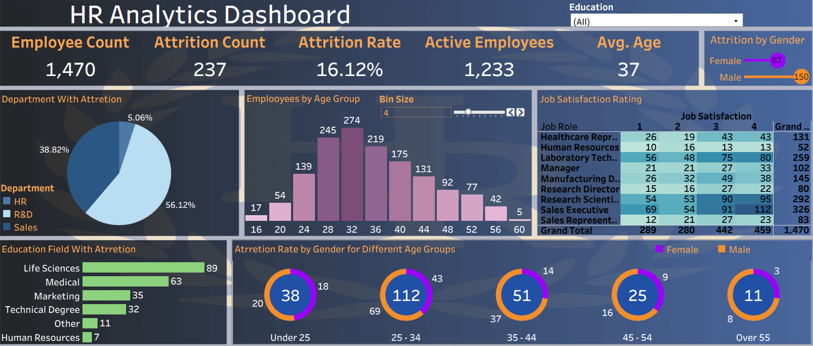

# HR Analytics Project

## Overview
An **HR Analytics Project** developed using **Tableau** to visualize and analyze HR data through interactive dashboards.

## Tools Used
- Tableau

## Project Structure
HR Analytics Project/
│
├── Data/
│ └── HR_Data.xlsx
│
├── Dashboard/
│ └── dashboard.png
│
├── Report/
│ └── Insights_and_Recommendations.pdf
│
└── README.md

## Folder Details

### Data
Contains the Excel file used as the data source for the project.

### Dashboard
Includes an image of the Tableau dashboard created for this analysis.

### Report
Includes **Insights_and_Recommendations**, which contains:
- KPIs
- Key Insights
- Strategic Recommendations

## Contact 
- **Email:** abdelrahmanr645@gmail.com
- **LinkedIn:** https://www.linkedin.com/in/abdelrahmn-reda/ 
